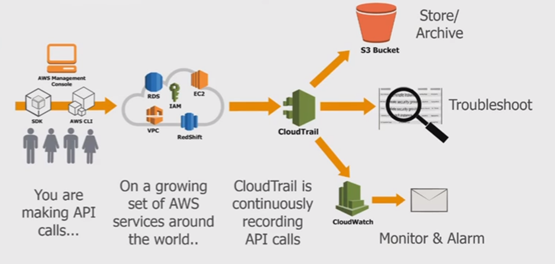

# CloudTrail

- A history of <table style="display:inline"><tr><td>all events</td></tr><tr><td>API calls</td></tr><tr><td>changes made through SDK</td></tr><tr><td>...</td></tr></table> to your AWS resources.
- Can be saved in CloudWatch/S3 for long-term retention.
- It is for governance, compliance, and audits.
- By default it trails all regions.
  - Can be limited to one region.

