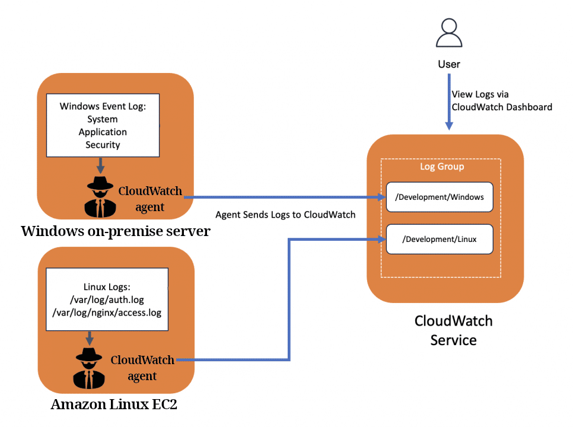

# CloudWatch

- Monitoring tool for your AWS resources and applications.
- Can create alarms that watch the metrics and send notifications or automatically make changes to the resources when a threshold is breached.
- Metrics have timestamps.
- No data aggregation between regions.
- Metrics for every service on AWS.
- Metric: A variable to monitor (CPUUtilization, NetworkIn, ...). You can find a complete list of all metrics [here](https://docs.aws.amazon.com/AWSEC2/latest/UserGuide/viewing_metrics_with_cloudwatch.html)

## Glossary

<table>
  <thead>
    <tr>
      <td>Name</td>
      <td>Description</td>
      <td>Side notes</td>
    </tr>
  </thead>
  <tbody>
    <tr>
      <td>Namespaces</td>
      <td>A container for CloudWatch metrics.</td>
      <td>
        Isolated from each other
        <small>
          (To prevent aggregating different apps' statistics in one place)
        </small>
        .
      </td>
    </tr>
    <tr>
      <td>Metrics</td>
      <td>A time-ordered set of data about the performance of your systems.</td>
      <td>
        <ul>
          <li>Region specific.</li>
          <li>
            By
            
              default
            
            gathered every 5 minutes.
          </li>
          <li>
            
              Expires
            ,
            rather than being deletable.
          </li>
          <li>Delete data older than 15 month as new data comes in.</li>
          <li>
            Either specify timestamps or CloudWatch will create it for you.
          </li>
          <li>
            <b 
              style="
                text-decoration: underline dotted;
                text-underline-offset: 0.1em;
                cursor: help;
              "
              title="Install CloudWatch Agent in your instances first"
            >
              NO
            </b>
            memory utilization and disk space usage metrics by default for
            EC2 instances.
          </li>
        </ul>
      </td>
    </tr>
    <tr>
      <td>Dimensions</td>
      <td>A key/value pair that uniquely identifies a metric.</td>
      <td>
        Whenever you add a unique dimension to one of your metrics, you are
        creating a new variation of that metric.
      </td>
    </tr>
    <tr>
      <td>Statistics</td>
      <td>Aggregated data over specified periods of time.</td>
      <td>
        <ul>
          <li>Specify a unit of measure are aggregated separately.</li>
          <li>
            Can specify a
            
              unit
            
            when you create a custom metric
          </li>
          <li>
            A
            
              period
            
            is the length of time associated with a specific CloudWatch
            statistic.
          </li>
          <li>
            Statistics are aggregated according to the period length that we
            specify.
          </li>
        </ul>
      </td>
    </tr>
  </tbody>
</table>

[Learn more](https://tutorialsdojo.com/amazon-cloudwatch/)

## Some important metrics

| Service       | Metrics                                                |
| ------------- | ------------------------------------------------------ |
| EC2 instances | CPU Utilization. Status Checks. Network.       |
| EBS Volumes   | Disk read/write.                                       |
| S3 Buckets    | BucketSizeBytes. NumberOfObjects. AllRequests. |
| API usage     | CloudWatch Lambda. S3.                         |

But we can also create our own metrics.

## CloudWatch alarms

- Goes off when a metric breaches a predefined threshold.
  - Can be based on percentage/max/min or other units.
  - Can configure how frequently check whether we breached the threshold or not.
  - Can be in different states:
    - OK.
    - INSUFFICIENT_DATA.
    - ALARM.
- Actions they can perform:
  - Send a notification.
  - Auto scaling.
  - Perform EC2 actions: stop/terminate/reboot/recover.
  - SNS notifications.
    1. You can easily create a new topic in SNS and subscribe to it with your email.
    2. Then in your CloudWatch you only need to create an alarm that publishes a message to that topic.
- Billing alarms can help us with budget management.

## CloudWatch logs

- Collecting log files.
- Can collects from:
  - ECS.
  - Lambda.
  - Route 53.
  - CloudTrail.
  - CloudWatch log agents installed on <table style="display:inline"><tr><td>EC2 instances[^1]</td></tr><tr><td>on-premises servers</td></tr></table>.
  - Elastic Beanstalk.
- You can monitor logs in real-time.
- Configurable in terms of retention; for how long should I keep them.

# Footnotes

[^1]: For this to work we need proper IAM role.
