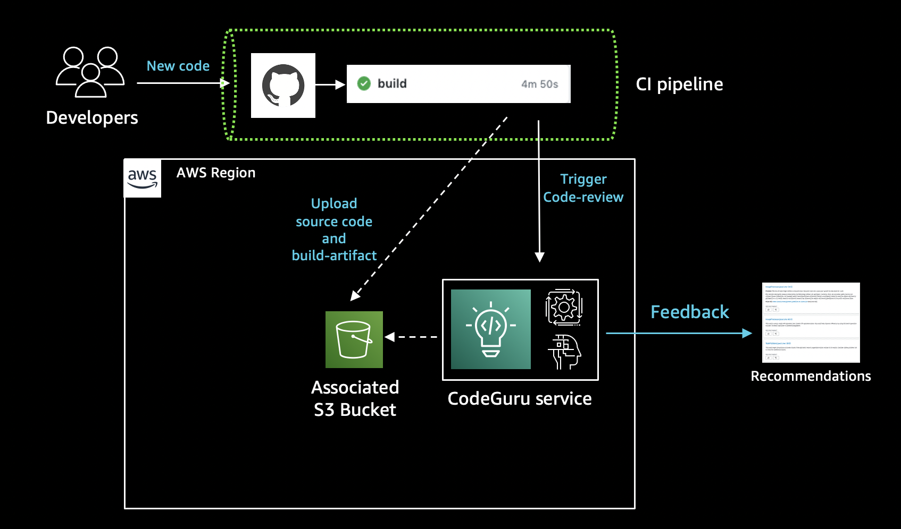
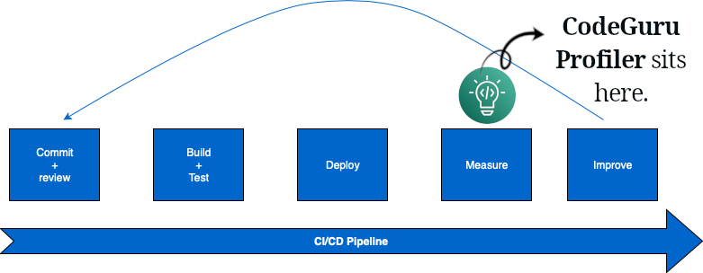

# CodeGuru

- ML-powered.
- CodeGuru Reviewer: Automates code reviews.
- CodeGuru Profiler: Sends us some app performance improvement suggestions.

## CodeGuru Reviewer

- Identifies <table style="display:inline"><tr><td>security vulnerabilities</td></tr><tr><td>bugs</td></tr><tr><td>performance hiccups</td></tr><tr><td>memory leaks</td></tr><tr><td>...</td></tr></table>
- Supports Java and Python.
- Integrated with GitHub, BitBucket, CodeCommit.

.

## CodeGuru Profile

- See where your application spends its time.
- Get recommendations to improve the performance.
- Reduce cost of your applications.
- Works for both AWS deployed apps, and on-premises ones.

