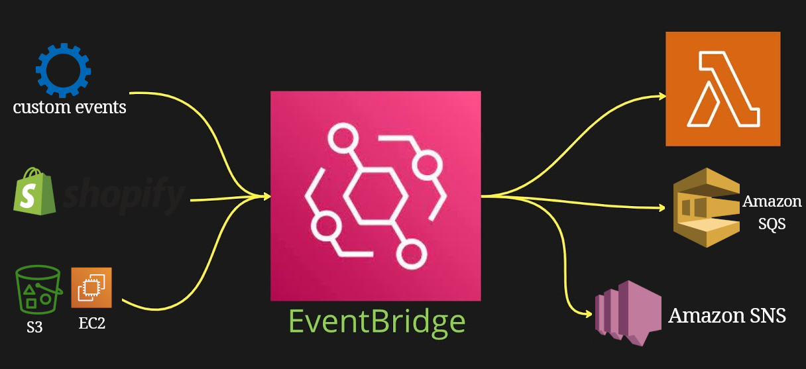
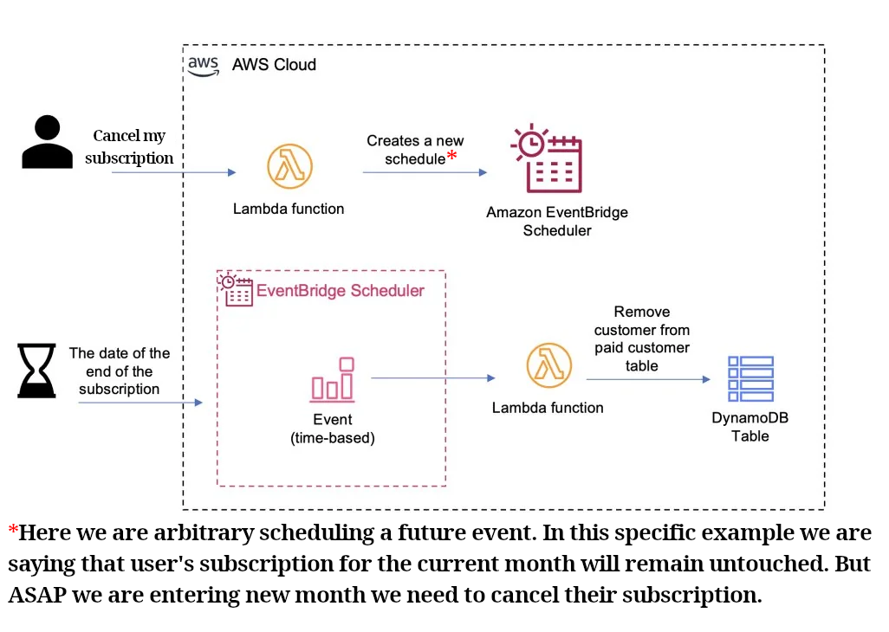
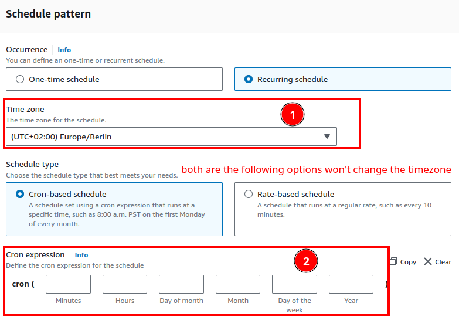
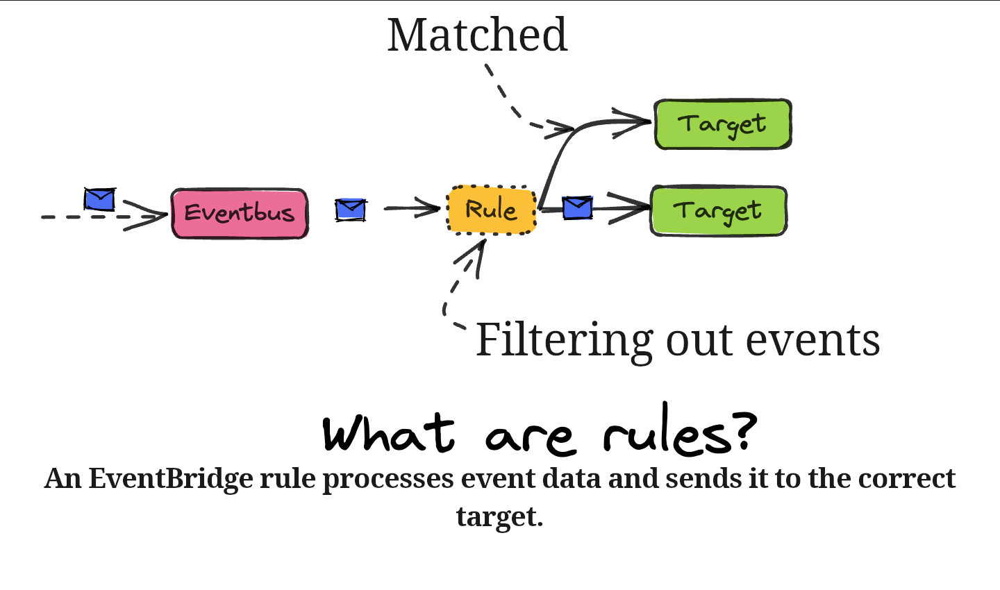
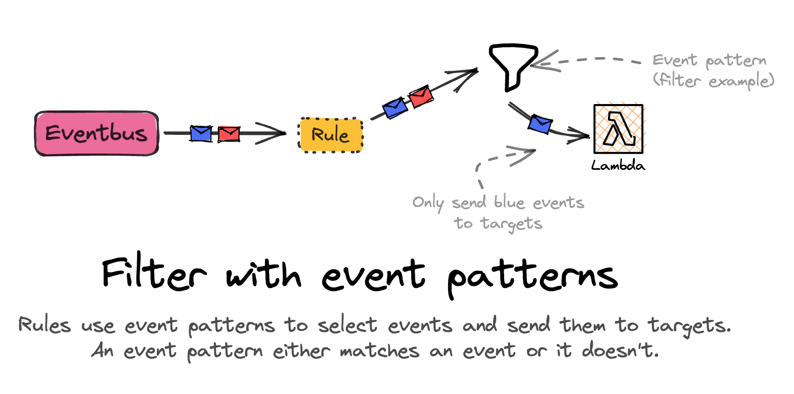

# EventBridge

- Enables us to build event-driven architecture apps/solutions.
- React to events happening in AWS.
  - E.g. Login with root user in AWS => publish a new message in SNS topic => receive an email.
- Schedule cron jobs.
- Can receive events from 3rd party sources such as: Shopify, DataDog, ...

  

- Can archive events.
- Can replay events:
  - E.g. to make sure that your data is up to date after adding new functionalities.
  - Specify <table style="display: inline"><tr><td>which archive to replay events from.</td></tr><tr><td>the start and end time for the event to replay.</td></tr><tr><td>the event bus.</td></tr></table>

## Cancel subscription example

## Creating new EventBridge

We have different type of EventBridges. So here is a list of the one that are offered ATM (29.07.2024).

| Type            | Description                                                                                                                                                   |
| --------------- | ------------------------------------------------------------------------------------------------------------------------------------------------------------- |
| Rule            | Matches incoming events and sends them to targets for processing.                                                                                             |
| Pipe            | Connects an event source, to a target, with optional filtering and enrichment.                                                                                |
| Schedule        | Invokes a target<table style="display:inline"><tr><td>one-time.</td></tr><tr><td>at regular intervals defined by a cron or rate expression.</td></tr></table> |
| Schema registry | We can define/discover our events schemas. And then we can organize those who can be grouped together in schema registry.                                     |

### EventBridge scheduler

- Scheduling functionality that provides <table style="display:inline"><tr><td>one-time</td></tr><tr><td>recurring</td></tr></table> scheduling functionality independent of Event buses and rules.
- It understands timezones: meaning that we do not need to deal with different timezones, [learn more](https://www.reddit.com/r/aws/comments/yrx1nj/comment/ivwigu4/?utm_source=share&utm_medium=web3x&utm_name=web3xcss&utm_term=1&utm_content=share_button).

  

- You can configure even the daylight saving time

### EventBridge rule

- With this we can define what we wanna happen if something else happened in one of the<table style="display:inline"><tr><td>AWS services.</td></tr><tr><td>EventBridge partners.</td></tr></table>
- **Note**: you can have as many target as you want.

#### Rule

#### Event pattern

When we are creating a new EventBridge rule we need to specify the patterns that should be targeted.

