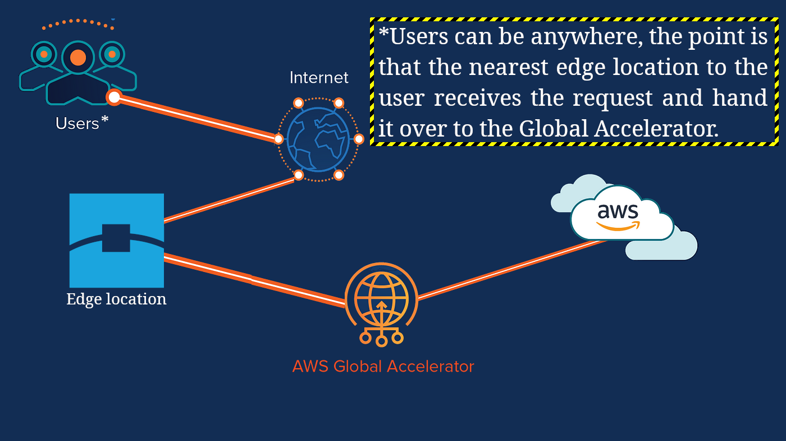
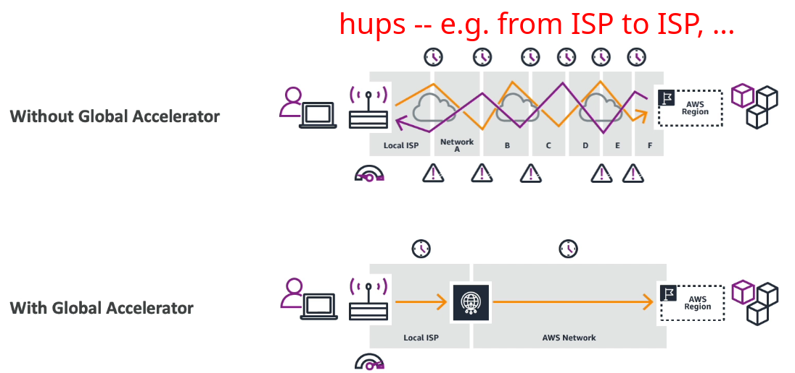

# Global Accelerator

- Improve global app availability and performance.
- Utilizes the internal network of AWS. Simply put, nearest edge location to the user receives the request (from the internet) and from that point onward AWS only relies on it private network for low-latency.
- Your app is accessible through 2 static IPs.
  - They are called Anycast IP
  - They will redirect us to the correct edge location.
- You can check how global accelerator can help you to have faster response time in [this website](https://speedtest.globalaccelerator.aws/).

## How it works

## Global accelerator VS internet

## Global accelerator VS CloudFront

Both are using AWS global infrastructure, but they serves different purposes.

| Global accelerator                                               | CloudFront                                        |
| ---------------------------------------------------------------- | ------------------------------------------------- |
| No caching                                                       | Caches your content                               |
| Response comes from the service itself                           | Content is served from the cached data            |
| Good for cases that we need static IP, or fast regional failover | Good for when we wanna cache our cachable content |
