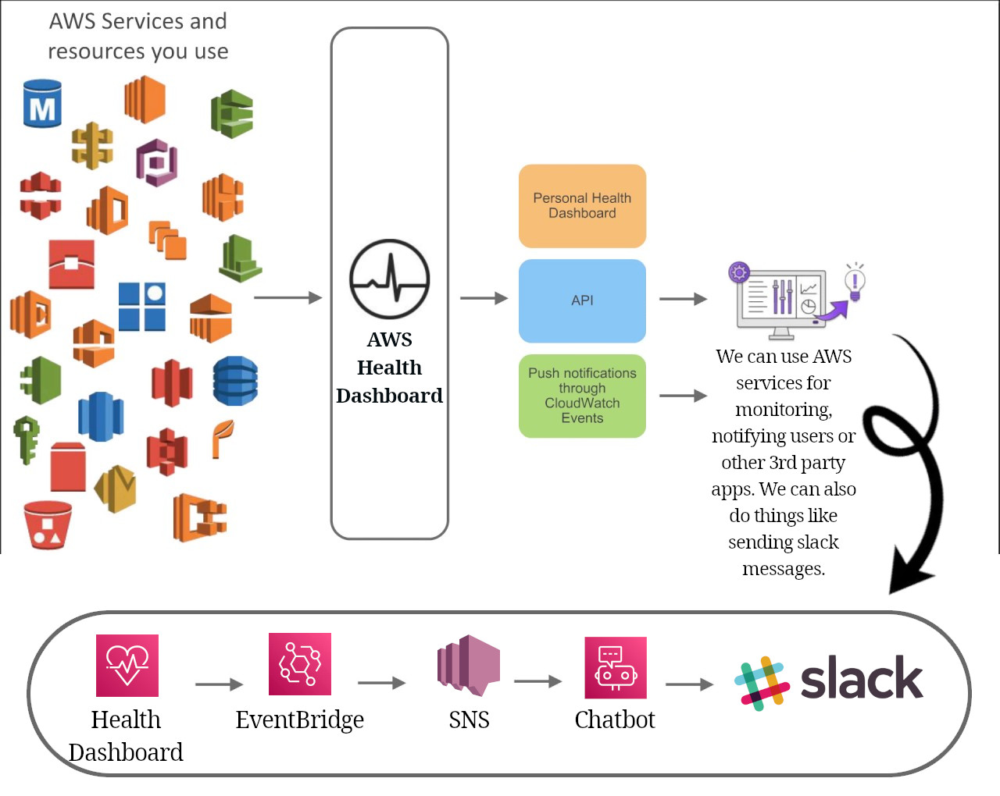

# AWS Health Dashboard

## Service history

- Where you can see all regions, and their services. So to see where, which service is unhealthy.
- You can subscribe to each service in each region through its RSS.

## Your account health

- These will affect you directly. Meaning the services that you're using are affected or will be.
- Can see upcoming maintenance.
- You can setup EventBridge rules to get notifications for events that might affect your services and resources.
- And you have a historical event log that shows you previous events.
