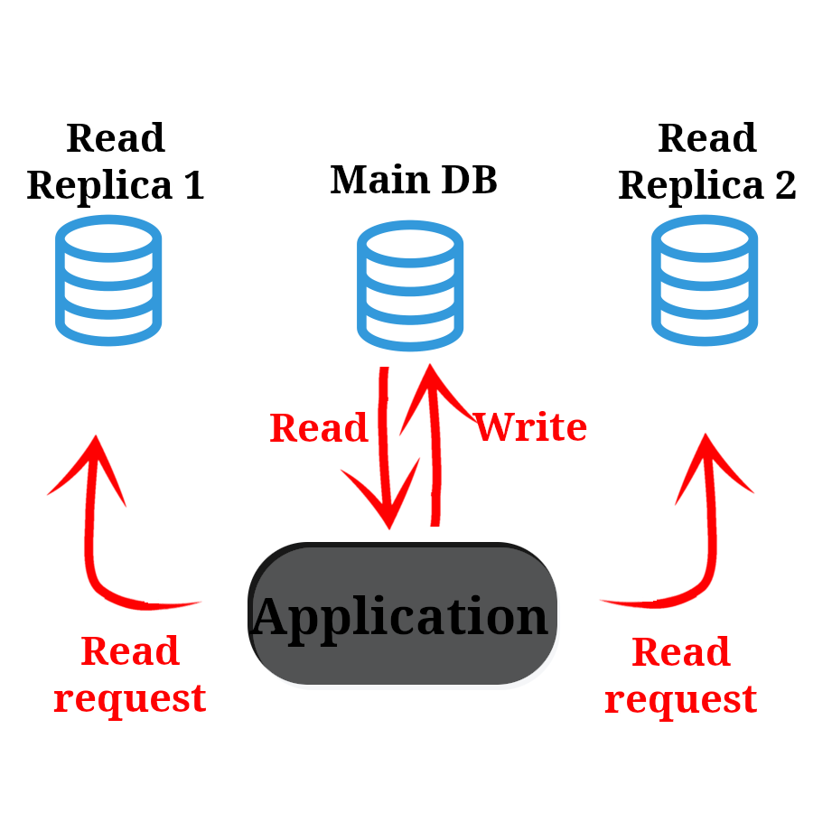
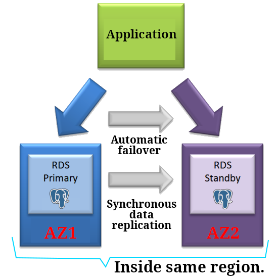
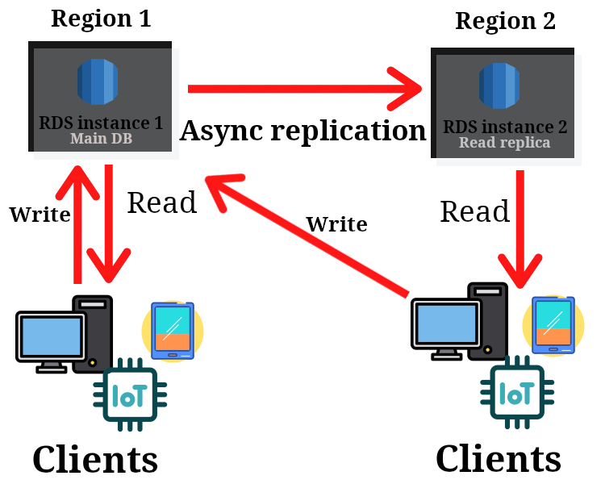

# RDS

- Manged service.
- [RDBMS](../README.md#rdbms).
- Can run Aurora , PostgreSQL :elephant:, MySQL, MariaDB, Oracle, IBM DB2, Microsoft SQL Server.
- | Pros                                                   |
  | ------------------------------------------------------ |
  | Monitoring.                                            |
  | Auto OS patching.                                      |
  | Continuous backup.                                     |
  | Multi-AZ setup possibility.                            |
  | Restore to any point in time.                          |
  | Horizontal & vertical scaling possibility.             |
  | Adding read replicas DBs to the existing DB instances. |

> [!NOTE]
>
> Since this is a manged service I think it is obvious that we cannot ssh to it.

## Aurora

- More expensive.
- Cloud optimized RDBMS.
- Supports PostgreSQL :elephant:, and MySQL.
- Storage can be increased incrementally <small>(10 GB)</small>.

## Deployments

<table>
  <thead>
    <tr>
      <th></th>
      <th>Read replicas</th>
      <th>Multi-AZ</th>
      <th>Multi-Region</th>
    </tr>
  </thead>
  <tbody>
    <tr>
      <td>Infographic</td>
      <td>
        
      </td>
      <td>
        
      </td>
      <td>
        
      </td>
    </tr>
    <tr>
      <td>Notes</td>
      <td>
        <ul>
          <li>Scale read workload of DB.</li>
          <li>Up to 15 read replicas.</li>
          <li>Write workload goes to the main DB.</li>
        </ul>
      </td>
      <td>
        <ul>
          <li>Can be deployed across up to 3 AZs.</li>
          <li>Keep data on your standby database instance (durability).</li>
          <li>
            High-availability:
            <ul>
              <li>Automatic fail over.</li>
              <li>Deploy a standby instance in a second AZ.</li>
            </ul>
          </li>
        </ul>
      </td>
      <td>
        <ul>
          <li>Billed for replication costs.</li>
          <li>Scale read workload acros regions.</li>
          <li>Writes requests goes to the main DB.</li>
          <li>
            Use cases:
            <ul>
              <li>Disaster recovery.</li>
              <li>Better local performance.</li>
            </ul>
          </li>
        </ul>
      </td>
    </tr>
  </tbody>
</table>

## Shared responsibility model

| AWS                                                                    | You                                               |
| ---------------------------------------------------------------------- | ------------------------------------------------- |
| Managing underlying EC2 instances.                                     | Manage database security groups.                  |
| DB and OS patching.                                                    | Manage users and their permissions within DB.     |
| Audit (Check) underlying disks & EC2 instances to guarantee they work. | Only allow SSL connections.                       |
|                                                                        | Encryption of data inside your DB if you need it. |
