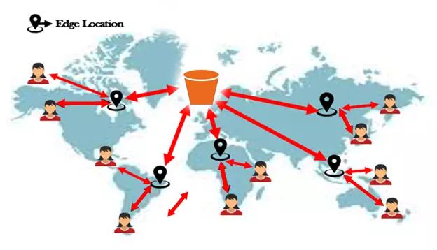

# S3 Transfer Acceleration

- S3 buckets are in one region.
- Accelerates global upload into & download from Amazon S3.
- You can test your S3 speed [here](https://s3-accelerate-speedtest.s3-accelerate.amazonaws.com/en/accelerate-speed-comparsion.html).
  > This speed checker uses multipart uploads to transfer a file from your browser to various Amazon S3 regions with and without Amazon S3 Transfer Acceleration. It compares the speed results and shows the percentage difference for every region.

