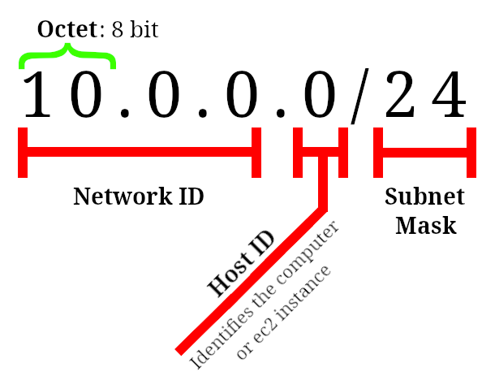
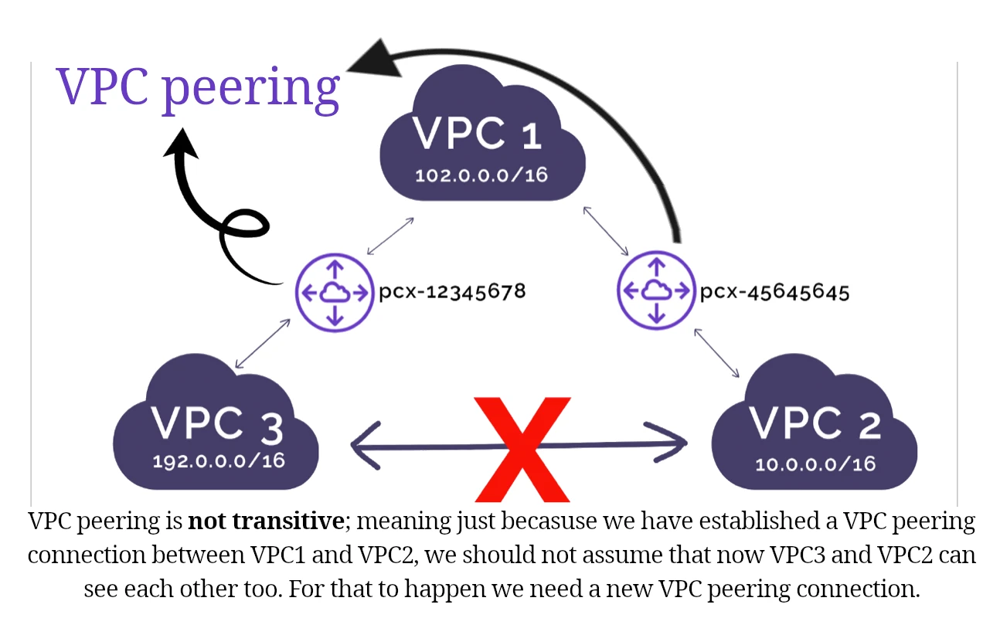
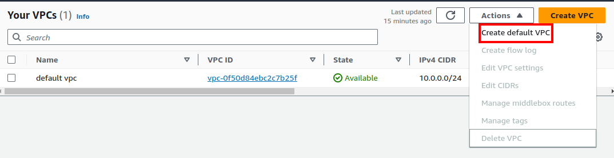
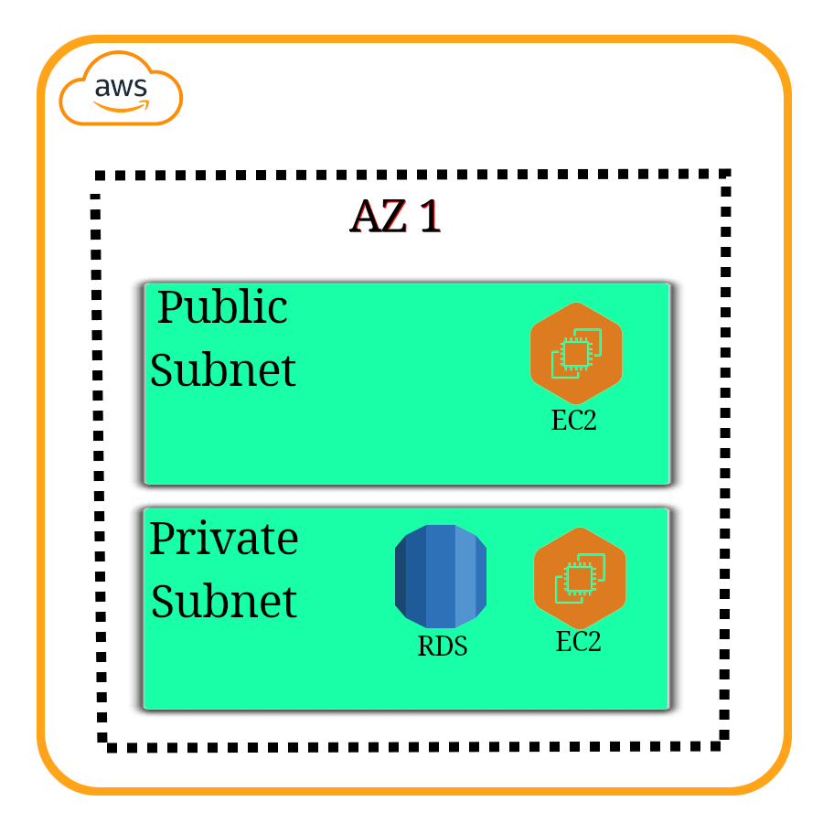
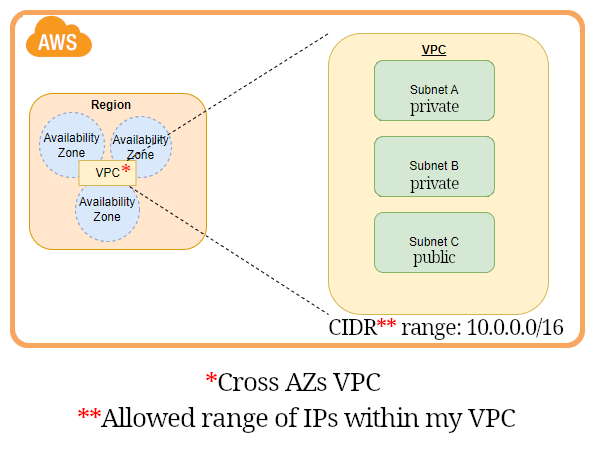
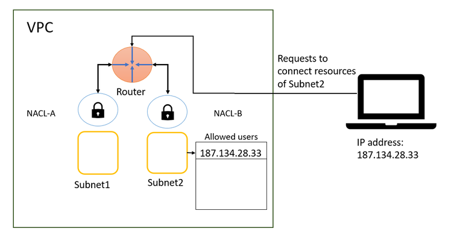
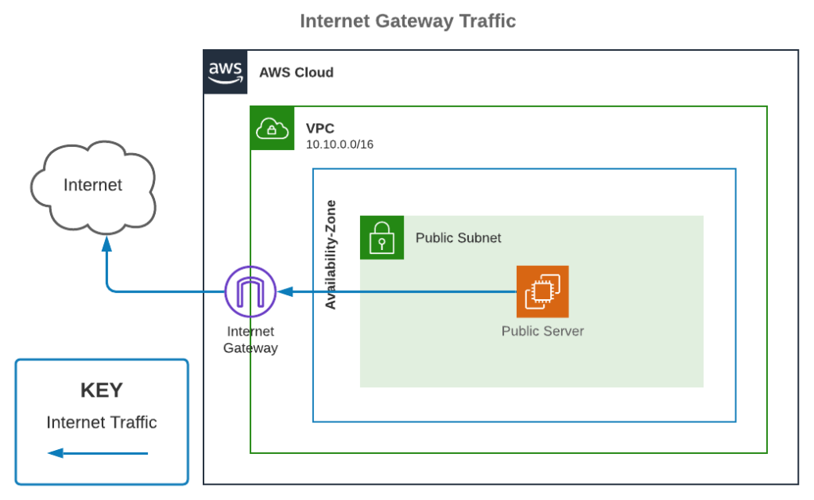
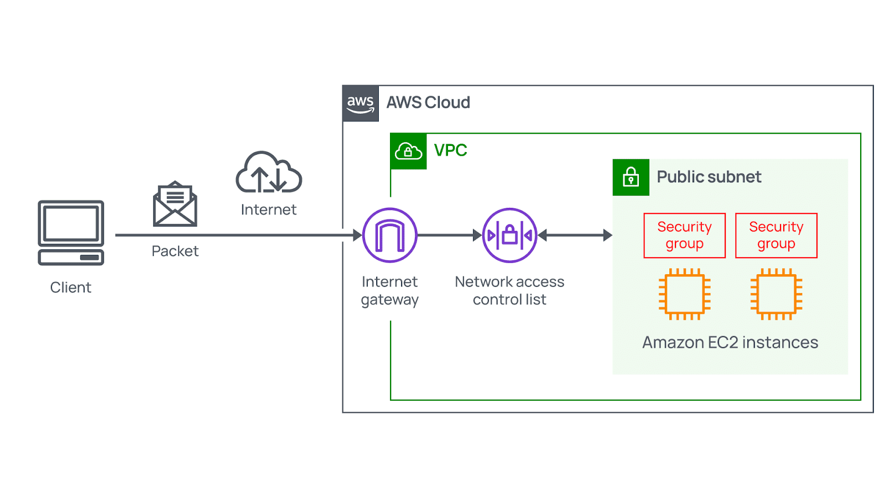
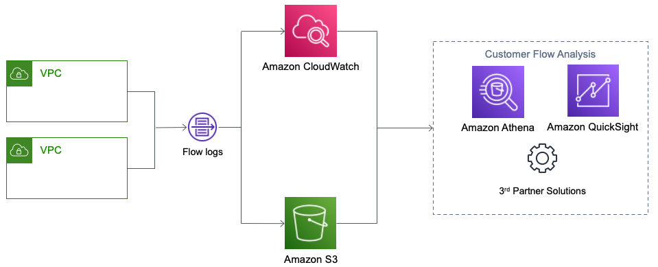

# VPC

- Stands for Virtual Private Cloud.
- Isolates resources within it.
- When we are creating one we need to specify the IPv4 CIDR block.

  - E.g. `10.0.0.0/24`
  - Each IP address consists of: network ID, host ID, subnet.

    

  - Classful addresses:
    Their _Network ID_ part is fixed and organizations could buy different classes:

    1. Class A: has 8 network prefix bits. E.g. `44.0.0.1`, where `44` is Network ID & `0.0.1` is the Host ID.
    2. Class B: has 16 network prefix bits. E.g. `44.16.0.22`, where `44.16` is Network ID & `0.22` is the Host ID.
    3. Class C: has 24 network prefix bits. E.g. `44.16.21.31`, where `44.16.21` is Network ID & `31` is the Host ID.

    Then we entered the era of classless IP addresses where the Host ID could vary by changing the _subnet mask_. They can alter the ratio between Network ID and Host ID.

  - Classless Inter-Domain Routing is an IP address allocation method that improves data routing efficiency on the internet.

    So we use variable length subnet masking (VLSM) to return the value of a network address, from the IP address, by turning the host address into zeroes. In other words we are breaking down an IP address space into subnets of various sizes.

  - You can check the range of IP that you'll get by going to [CIDR.xyz](https://cidr.xyz/).

  But if these explanations are too hard to understand right away I guess you could also interpret the _subnet mask_ as an indicator that determines which part of the Network ID should change.

- You can assign an EIP[^1] to your EC2 instance.
- Linked to a region.
- VPC peering connection:

  - A networking connection between two VPCs that enables you to route traffic between them privately.
  - Crosses regions/accounts.

  

> [!IMPORTANT]
>
> By clicking on "Create VPC" you're gonna create a new VPC which is not the default VPC. If you've deleted your default VPC you need to create a new default VPC by clicking on "Create default VPC" in "Actions"\* dropdown.
>
> Uncheck all the selected VPCs in the VPC's table to see "Create default VPC" option.
>
> 

## Classful VS Classless IP addresses

| Classful                                                 | Classless                                                                 |
| -------------------------------------------------------- | ------------------------------------------------------------------------- |
| Inflexible (Waste of IP address spaces)                  | Flexible                                                                  |
| Cannot combine networks of different classes             | Can combine networks of different classes                                 |
| Less efficient since all devices are in one huge network | route data packets to the respective device based on the indicated subnet |

> [!TIP]
>
> AWS **charges you** for every single **public IPv4** you're using. **BUT** you can use **IPv6** instead which is **free**. JFI: all IPv6 are public.

# Subnet

Next stop after creating VPC is to create subnets.

- We will use subnets to partition our VPC.
- It is a defined set of IP addresses.
- They can be public or private.

  - We usually create 2 for each, placed in different AZs (for hight-availability).
  - And you might wanna have more private IP addresses.

  

- Each subnet must be:
  1. Associated to a VPC.
  2. In an AZ.
  3. With a specific non conflicting CIDR.

## NACL

- AKA Network ACL.
- Stands for Network Access Control List.
- Virtual firewall around subnets.
- Stateless: You need to define outbound rules to let requests out (implying that you do not have access to outside world unless you explicitly define it).
- Can be used to block an **IP address** at subnet level.
- ALLOW or DENY rules.

### Route tables

Next step is enabling our EC2 instance to connect to the internet.

- Subnets need to know how they can connect to other networks (route to it).
  - E.g. Internet, another subnet, etc.
- Each route table belongs to one VPC.
  - After creating a subnet we need to explicitly associate it to a subnet.
- By default when you create a new VPC AWS creates a main default route table for us.

> [!NOTE]
>
> After creating the route table you need to create an internet gateway and add it to the public route table as a route so that your EC2 instances can access internet.

# Gateway

- A gateway connects your VPC to another network.

## Internet gateway

- It's a special gateway. As its name implies it connects our VPC to the internet.

  

- How it works:
  1. Create a new internet gateway.
  2. We attach it to our VPC.
  3. Then in subnet's _route table_ we can add it as a route, its type is Internet gateway.
     
- It is responsible for Network Address Translation (NAT).

So now your EC2 instances who are within the public subnet must be reachable through internet. Now we can work on our private subnet. It needs to access internet, remember we said that NACL is stateless. Thus we need to create a NAT gateway.

### NAT gateway

- Manged by AWS.
- Stands for Network Address Translation.
- EC2 instances who are placed in a private _subnet_ need to access internet.
  > [!NOTE]
  >
  > They are not publicly accessible. But they can and need to have access to the internet.
- So we create a NAT gateway in a public subnet and route private subnet requests to it.
- It needs an EIP[^1] to work.
  - EIP must match the network border group of the AZ that you're launching the public NAT gateway into. You can see the network border group for the subnet's AZ by viewing the details of the subnet.

> [!NOTE]
>
> After you've created the NAT gateway you still need to add it as a route to your private subnet.

> [!TIP]
>
> NAT instance: we can run a self-managed version of NAT.

# Security Group

- Virtual firewall around our EC2 instance
- They are associated with _network interfaces_.
- Stateful.
- Can only ALLOW.
- Can reference other security groups.

## Security group VS NACL

|                     | Security Group                                                                                       | NACL                                                                                                                            |
| ------------------- | ---------------------------------------------------------------------------------------------------- | ------------------------------------------------------------------------------------------------------------------------------- |
| Works at            | EC2 instance level.                                                                                  | Subnet level.                                                                                                                   |
| Supports            | ALLOW rules.                                                                                         | ALLOW/DENY rules.                                                                                                               |
| Connection tracking | Stateful: they automatically allow return traffic that corresponds to an allowed inbound connection. | Stateless: they do not track the state of connections, thus explicit rules for both inbound and outbound traffic are necessary. |
| Configuring it      | You must explicitly say it.                                                                          | It is automatically applied (Each instance is within a subnet).                                                                 |

# VPC flow logs

- Log network traffics.
  - It is not limited to EC2 instances and your RESTful APIs essentially.
  - Can be AWS managed services such as: RDS, Aurora, ElastiCache, Elastic load balancer, etc.
  - Store them in S3, CloudWatch logs, Kinesis data firehouse.
- Identify patterns, threats, and risks across your VPC network.

# References

\-[ref](https://www.youtube.com/watch?v=2doSoMN2xvI)

# Footnotes

[^1]: Elastic IP. A fixed public IP dedicated to our EC2 instance or NAT gateway.
