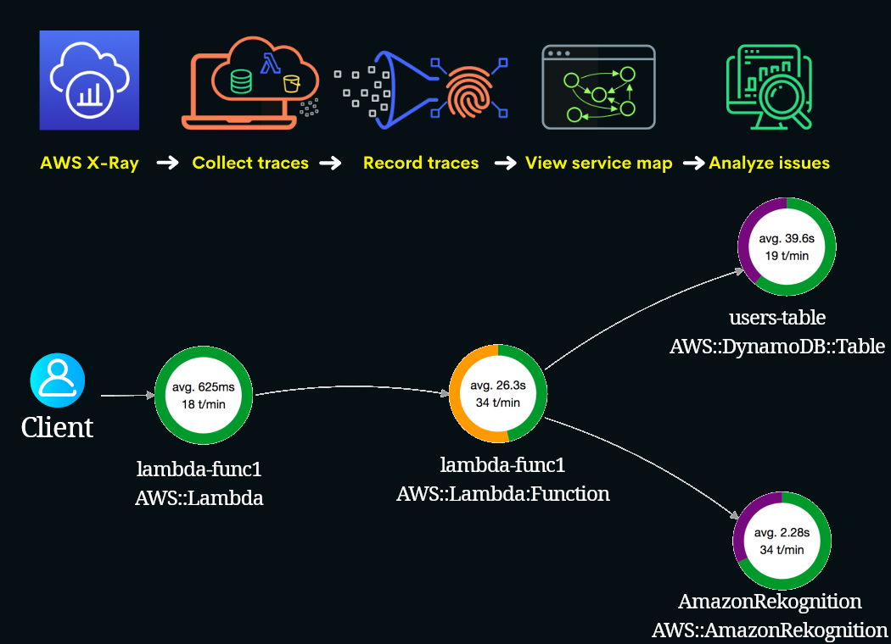

# X-Ray

- Analyze and debug production and distributed applications
- Trace user requests.
- Identify bottlenecks: where high latencies are occurring.
- Real-time serverless apps debugging.
- Making sure that we are meeting our SLA[^1].

# Footnotes

[^1]: Service Level Agreement.
