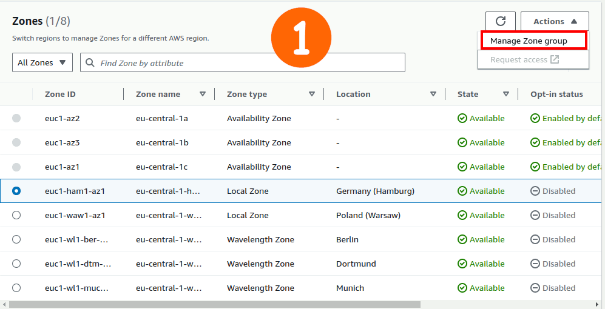
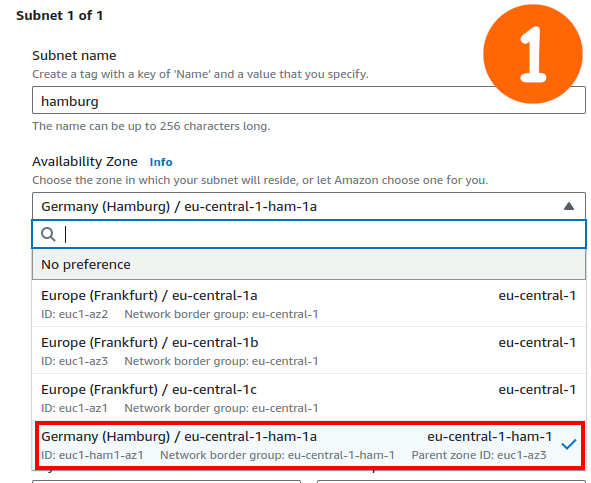
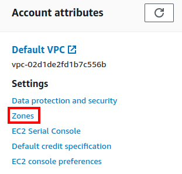
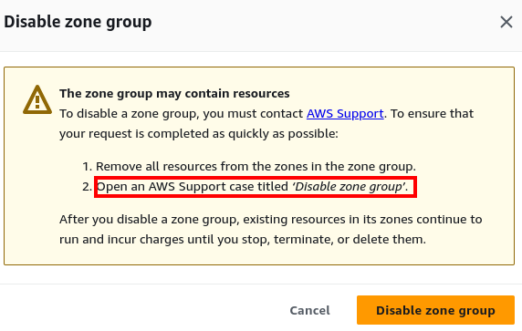

# Local zones

- <table style="display: inline;"><tr><td>Compute</td></tr><tr><td>Storage</td></tr><tr><td>Database</td></tr><tr><td>Other selected AWS resources</td></tr></table> close to <b>large population and industry centers</b>.
- Good for
  - latency-sensitive apps.
    - Virtual Reality.
    - Augmented Reality.
    - Virtual workstations.
  - Migrate to cloud steadily.
  - Comply with state and local data residency requirements in sectors such as healthcare, financial services, iGaming[^1], and government
- Extend your VPC to this local zones.

  1. Enable the LZ.

     

  2. Create a new subnet for it in the <table style="display: inline;"><tr><td>default</td></tr><tr><td>your custom</td></tr></table> VPC.

     

  3. Now you can pick this new zone when creating for example an EC2 instance.

- Compatible with some services: EC2, ElastiCache, ...
- All regions do not have LZ. You can check it for EC2 by going to "EC2 Dashboard", and then on the far right hand side "Account attributes". Click on the zones.

  

  After that you can see a list of zones with their types.

> [!NOTE]
>
> For some reason that IDK you have to open a support ticket for disabling an enabled local zone. But regarding costs it is free of charge if you enable them:
>
> > You can enable Local Zones without any additional fees. You pay only for the services you consume in Local Zones.
>
> \-[Ref](https://aws.amazon.com/about-aws/global-infrastructure/localzones/features/#:~:text=AWS%20services,-You%20can%20use&text=You%20can%20enable%20Local%20Zones,you%20consume%20in%20Local%20Zones.)
>
> > 

## Footnotes

[^1]: Any kind of online betting that wagers on the future outcome of a game or event.
