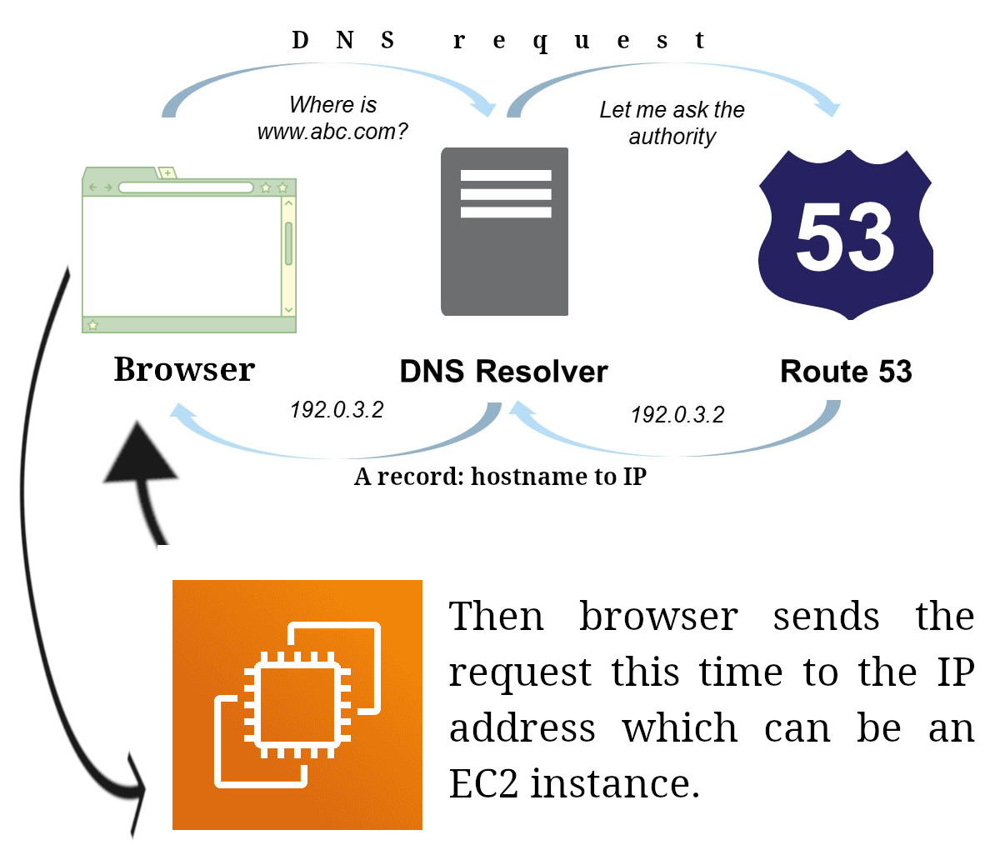
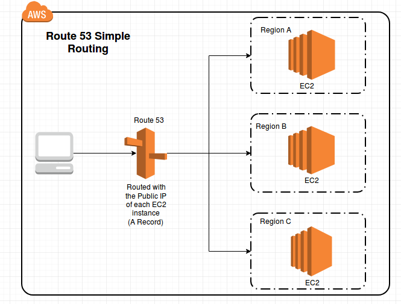

# Route 53

- Managed by AWS.
- A Domain Name System[^1].
- Route users to the closest deployment with minimum latency.
- Used for disaster recovery.

## DNS Records

| Name      | Mapped value                            | Type        | IP version |
| --------- | --------------------------------------- | ----------- | ---------- |
| www.x.com | 10.76.12.234                            | A record    | 4          |
| www.x.com | 2001:0db8:0000:0000:0000:7a6e:0680:9668 | AAAA record | 6          |
| www.x.com | www.twitter.com                         | CNAME       |            |
| www.x.com | AWS resource                            | Alias       |            |

## How it works

    

        See a more advanced version.
    

    

## Route 53 routing policies

- Simple routing policy:

  - No health check.

  

- Weighted routing policy:

  - Distributes requests between different EC2 instances. Some sort of load balancing.
  - We assign weight to each EC2 instance and it will redirect requests to each based on the weight.

  

- Latency routing policy:

  - Connects users based on their location to the closest server.

  

- Failover routing policy:

  - Perform health check on the EC2 instances and in case of unhealthy it will redirect requests to the failover instance.

  

[^1]: A collection of rules and records which helps clients to understand how to reach a server through URL.
