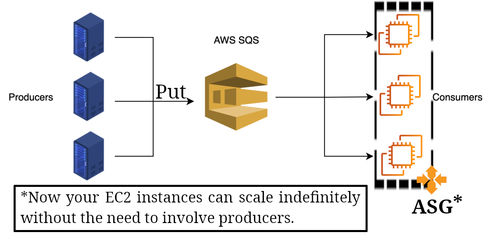
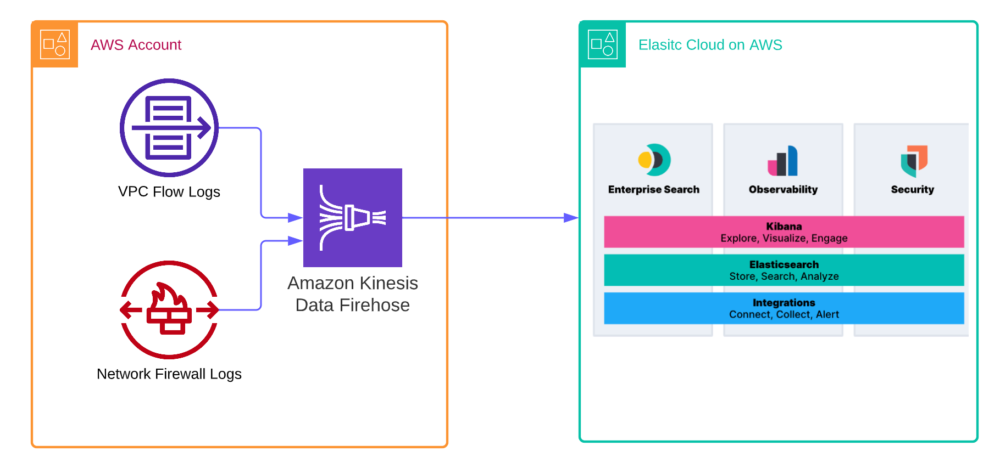

# Cloud integration

Our apps need to talk to each other. And we have two type of communication

<table>
  <thead>
    <tr>
      <th style="text-align: center">Name</th>
      <th style="text-align: center">AKA</th>
      <th style="text-align: center">Description</th>
      <th style="text-align: center">Pros</th>
      <th style="text-align: center">Cons</th>
      <th style="text-align: center">Used in</th>
      <th style="text-align: center">Visialization</th>
    </tr>
  </thead>
  <tbody>
    <tr>
      <td>Synchronous communication</td>
      <td></td>
      <td>They talk directly to each other.</td>
      <td>
        <ul>
          <li>Simplicity.</li>
          <li>Easier to Implement.</li>
          <li>Immediate Consistency.</li>
        </ul>
      </td>
      <td>
        <ul>
          <li>Tight Coupling.</li>
          <li>Blocking Behavior.</li>
          <li>Scalability Issues.</li>
        </ul>
      </td>
      <td>
        <ul>
          <li>RESTful APIs.</li>
          <li>Client-server models.</li>
          <li>RPC (Remote Procedure Call) systems.</li>
        </ul>
      </td>
      <td></td>
    </tr>
    <tr>
      <td>Asynchronous communication</td>
      <td>Event based communication</td>
      <td>
        In this method applications talk to each other through a message queue.
      </td>
      <td>
        <ul>
          <li>Decoupling.</li>
          <li>Scalability.</li>
          <li>Performance.</li>
          <li>Resilience and Fault Tolerance.</li>
        </ul>
      </td>
      <td>
        <ul>
          <li>Complexity.</li>
          <li>Eventual Consistency.</li>
          <li>Difficulty in Error Handling.</li>
        </ul>
      </td>
      <td>
        <ul>
          <li>Event-driven architectures.</li>
          <li>Microservices with message brokers.</li>
          <li>Microservices with publish/subscribe models.</li>
        </ul>
      </td>
      <td></td>
    </tr>
  </tbody>
</table>

Choosing between async and sync communication depends on factors like:

- Nature of the application.
- Performance requirements.
- Expected load.
- Failure tolerance.
- Complexity of implementation.

Often, systems might use a combination of both, leveraging synchronous communication where immediate responses and simplicity are crucial, and asynchronous communication for operations that can tolerate delays or require higher scalability and fault tolerance. Now we can talk about AWS services which enable us to implement async architecture.

## SQS

- Simple Queue Service.
- Low latency.
- Serverless.
- Scalable.
- Limitless in terms of how many messages can we put on the queue.
- Message retention period: <table style="display: inline;"><tr><td>Min: 4 days</td></tr><tr><td>Max: 14 days</td></tr></table>
- Messages are deleted after they were read.
- Consumers read the messages and share the work horizontally.
- Dead-letter queue (DLQ):
  - a special type of message queue that temporarily stores messages that a software system **cannot process** due to errors. Usually all softwares have a regular message queue and a DLQ. They use the regular queue to hold messages they plan to send to a destination. If the receiver fails to respond or process the sent messages, it will be moved them to the DLQ.
  - Merits of having one:
    - Reduced communication costs: Instead of waiting for the failing message to expire we can move them to DLQ after a few attempts.
    - Improved troubleshooting.

### Video processing example

Assume you have a group of replicated RESTful APIs which receives http requests from your client-side applications (e.g. mobile apps, SPAs). And now you need to process those videos. So you could do it in your RESTful API backend (assume it is written in NodeJS). But then you might face some difficulties such as performance issues, tightly coupled, cost-inefficient backend.

So in these cases we can have a separate service which takes care of video processing for us and our NodeJS app simply push a new message into the message queue (SQS) and our other service will consume them.

### FIFO queue feature

- First In First Out.
- So by utilizing this feature we are sure that our app will consume the messages in the right order.

### Creating a SQS

When you're creating a new SQS you need to specify:

1. Visibility timeout:

   - The time a message is hidden from other consumers after being received by one consumer.
   - If a consumer doesn't process and delete the message before the visibility timeout expires, the message becomes visible again to other consumers.
   - To ensure a message is only processed once, it must be deleted before the visibility timeout ends.
   - The default visibility timeout is 30 seconds for all messages in the queue.
   - Should be set longer than the maximum time needed to process and delete a message.
   - Set the visibility timeout longer than the AWS SDK read timeout, whether using short or long polling with the ReceiveMessage API.

     - AWS SDK read timeout: The maximum time the AWS SDK will wait for a response when making a call to receive messages.
     - Polling mechanisms:

       <table>
         <thead>
           <tr>
             <th>Name</th>
             <th>Default</th>
             <th>Description</th>
             <th>Upsides</th>
             <th>Downsides</th>
             <th>Use cases</th>
           </tr>
         </thead>
         <tbody>
           <tr>
             <td>Short polling.</td>
             <td>&check;</td>
             <td>
               <code>sqs.receiveMessage</code> queries <b>a subset of SQS servers</b>
               to find available messages and sends an immediate response.
             </td>
             <td>
               <ul>
                 <li>Simple Implementation.</li>
                 <li>Immediate Response.</li>
               </ul>
             </td>
             <td>
               <ul>
                 <li>Higher request rates.</li>
                 <li>Increased Server Load.</li>
               </ul>
             </td>
             <td>
               <ul>
                 <li>
                   Suitable for big queues where we can assume always to have messages
                   available.
                 </li>
                 <li>
                   Single thread apps in which they need to poll multiple queues, long
                   polling may not work as the main thread will be blocked and messages
                   from other queues cannot be polled.
                 </li>
               </ul>
             </td>
           </tr>
           <tr>
             <td>Long polling.</td>
             <td>&cross;</td>
             <td>
               <code>sqs.receiveMessage</code> queries <b>all SQS servers</b> for
               messages, sending a response once at least one message is available.
             </td>
             <td>
               <ul>
                 <li>
                   Reduce the cost by eliminating the number of empty responses
                   <small>(<code>WaitTimeSeconds</code>)</small>.
                 </li>
                 <li>
                   Reduce false empty responses by querying all
                   <small>(rather than a subset of)</small> SQS servers.
                 </li>
                 <li>Return messages as soon as they become available.</li>
               </ul>
             </td>
             <td>
               <b>None</b> that I can remember of. Although you might have a tougher
               time to implement it:
               <ul>
                 <li>multi-threading</li>
                 <li>
                   configuring HTTP to not close the connection when your
                   <code>WaitTimeSeconds</code> is 20 seconds
                 </li>
               </ul>
               But I guess that's not too hard either.
             </td>
             <td>
               <ul>
                 <li>For processing messages as soon as they become visible.</li>
                 <li>
                   <b>
                     Long polling is <em>almost always preferable</em> to short polling
                   </b>
                 </li>
               </ul>
             </td>
           </tr>
         </tbody>
       </table>

   

2. Delivery Delay:

   - This is the time new messages are hidden before consumers can see them.
   - Useful to coordinate with external systems:
     - Delays can be used to align message processing with external system readiness.
     - E.g.:
       - Your service saves the file in a S3 bucket and you're replicating them across regions. Now we know it might take some time for our newly added object to be available everywhere. As for the post-upload processes, done via other consumers we might need some time so that the object is replicated into different regions/AZs.
       - You send a message and need two minutes to ensure that data is present in the database which is inserted by another process in a parallel manner. In this case SQS waits for 2 minutes or the time which your service takes to complete the insert process before making the message visible in the queue.
   - You can alter the default `DelaySeconds` when invoking `sqs.sendMessage`.

   

3. Receive message wait time:

   - The amount of time a `sqs.receiveMessage` in a long polling mechanism waits for messages.
   - Min: 0 second.
   - Max: 20 seconds.

4. Message retention period:

   - For how long SQS should keep messages in the queue when they have not been deleted.
   - Min: 4 days.
   - Max: 14 days.

5. Maximum message size:

   - Min: 1 byte (1 character).
   - Max: 256 KB.

## SNS

- Implements publish/subscribe pattern.

  

  - Publisher sends messages only to one topic.
  - Subscribers can listen to multiple topics.
    - Supported protocols

- Stands for Simple Notification Service.

## Kinesis

- Managed by AWS.
- Real-time big data streaming: <table style="display: inline"><tr><td>Collects</td></tr><tr><td>Processes</td></tr><tr><td>Analyses<td></tr></table> real-time streaming data.
- Features:

  <table>
    <thead>
      <tr>
        <th>Name</th>
        <th>Description</th>
        <th>Used for</th>
        <th>Infographic</th>
      </tr>
    </thead>
    <tbody>
      <tr>
        <td>Kinesis Data Streams.</td>
        <td>
          Collect gigabytes of data per second from different sources and make it
          available for processing and analyzing in real time.
        </td>
        <td>
          <ul>
            <li>Log and event data collection</li>
            <li>IoT device data capture</li>
            <li>Mobile data collection</li>
            <li>Gaming data feed</li>
          </ul>
        </td>
        <td></td>
      </tr>
      <tr>
        <td>Amazon Data Firehose.</td>
        <td>
          Prepare and load real-time data streams into data stores and analytics
          tools.
        </td>
        <td>
          <ul>
            <li>Log and event analytics</li>
            <li>IoT data analytics</li>
            <li>Clickstream analytics</li>
            <li>Security monitoring</li>
          </ul>
        </td>
        <td></td>
      </tr>
      <tr>
        <td>Managed Apache Flink.</td>
        <td>
          Analyze streaming data and gain actionable insights in real time. You
          can use Python, Java, Scala, or SQL to do that.
        </td>
        <td>
          <ul>
            <li>Real-time streaming ETL.</li>
            <li>Real-time log analytics.</li>
            <li>Ad tech and digital marketing analytics.</li>
            <li>Real-time IoT device monitoring.</li>
          </ul>
        </td>
        <td></td>
      </tr>
    </tbody>
  </table>

### Kinesis Video Streams

- It ingests real-time video streams for analytics/ML.

# Open protocols

SQS, SNS, and their friends are proprietary used in AWS. But we might need something a bit more open and accessible, protocols like:

- MQTT.
- AMQP.
- STOMP.
- Openwire.
- WSS.

## MQ

- Message broker for RabbitMQ, and ActiveMQ.
- Needs more configuration in terms of <table style="display: inline"><tr><td>scaling</td></tr><tr><td>Disaster recovery plan</td></tr><tr><td>High-Availability</td></tr><tr><td>Global latency</td></tr></table>.
- Comes with queue and topic feature, similar to SQS and SNS respectively.

# SQS VS RabbitMQ

In General you need to consider these topic when choosing between them:

0. Are you migrating to the cloud? if yes, you might wanna stick to your open protocol since you do not need to refactor your app. At least for the time being.
1. Costs.
2. Speed.
3. scalability.
4. Maintenance.
