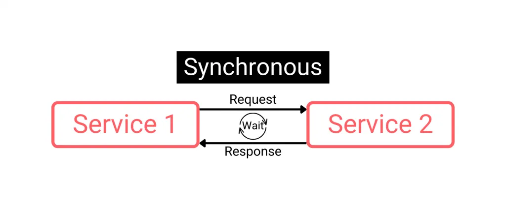
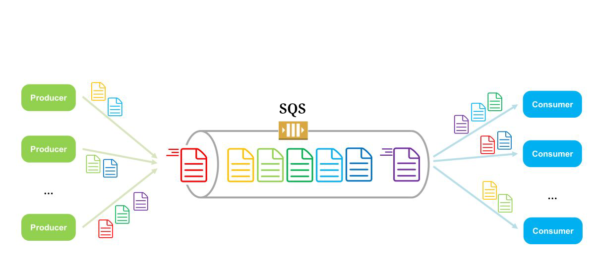
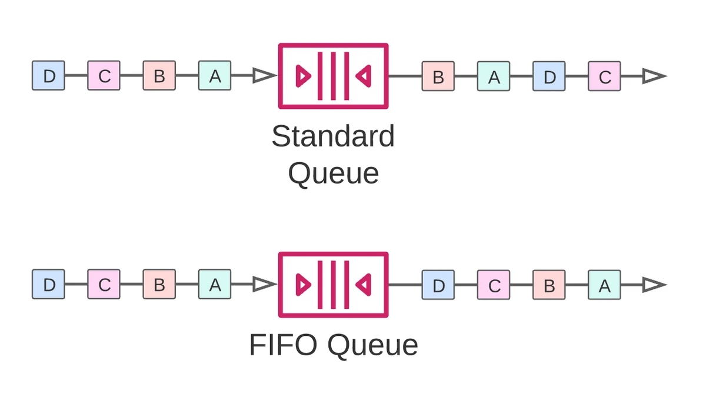

# Cloud integration

Our apps need to talk to each other. And we have two type of communication

<table>
  <thead>
    <tr>
      <th style="text-align: center">Name</th>
      <th style="text-align: center">AKA</th>
      <th style="text-align: center">Description</th>
      <th style="text-align: center">Pros</th>
      <th style="text-align: center">Cons</th>
      <th style="text-align: center">Used in</th>
      <th style="text-align: center">Visialization</th>
    </tr>
  </thead>
  <tbody>
    <tr>
      <td>Synchronous communication</td>
      <td></td>
      <td>They talk directly to each other.</td>
      <td>
        <ul>
          <li>Simplicity.</li>
          <li>Easier to Implement.</li>
          <li>Immediate Consistency.</li>
        </ul>
      </td>
      <td>
        <ul>
          <li>Tight Coupling.</li>
          <li>Blocking Behavior.</li>
          <li>Scalability Issues.</li>
        </ul>
      </td>
      <td>
        <ul>
          <li>RESTful APIs.</li>
          <li>Client-server models.</li>
          <li>RPC (Remote Procedure Call) systems.</li>
        </ul>
      </td>
      <td></td>
    </tr>
    <tr>
      <td>Asynchronous communication</td>
      <td>Event based communication</td>
      <td>
        In this method applications talk to each other through a message queue.
      </td>
      <td>
        <ul>
          <li>Decoupling.</li>
          <li>Scalability.</li>
          <li>Performance.</li>
          <li>Resilience and Fault Tolerance.</li>
        </ul>
      </td>
      <td>
        <ul>
          <li>Complexity.</li>
          <li>Eventual Consistency.</li>
          <li>Difficulty in Error Handling.</li>
        </ul>
      </td>
      <td>
        <ul>
          <li>Event-driven architectures.</li>
          <li>Microservices with message brokers.</li>
          <li>Microservices with publish/subscribe models.</li>
        </ul>
      </td>
      <td></td>
    </tr>
  </tbody>
</table>

Choosing between async and sync communication depends on factors like:

- Nature of the application.
- Performance requirements.
- Expected load.
- Failure tolerance.
- Complexity of implementation.

Often, systems might use a combination of both, leveraging synchronous communication where immediate responses and simplicity are crucial, and asynchronous communication for operations that can tolerate delays or require higher scalability and fault tolerance. Now we can talk about AWS services which enable us to implement async architecture.

## SQS

- Simple Queue Service.
- Low latency.
- Serverless.
- Scalable.
- Limitless in terms of how many messages can we put on the queue.
- Message retention period: <table style="display: inline;"><tr><td>Min: 4 days</td></tr><tr><td>Max: 14 days</td></tr></table>
- Messages are deleted after they were read.
- Consumers read the messages and share the work horizontally.

### Video processing example

Assume you have a group of replicated RESTful APIs which receives http requests from your client-side applications (e.g. mobile apps, SPAs). And now you need to process those videos. So you could do it in your RESTful API backend (assume it is written in NodeJS). But then you might face some difficulties such as performance issues, tightly coupled, cost-inefficient backend.

So in these cases we can have a separate service which takes care of video processing for us and our NodeJS app simply push a new message into the message queue (SQS) and our other service will consume them.

### FIFO queue feature

- First In First Out.
- So by utilizing this feature we are sure that our app will consume the messages in the right order.

## SNS

## Kinesis
