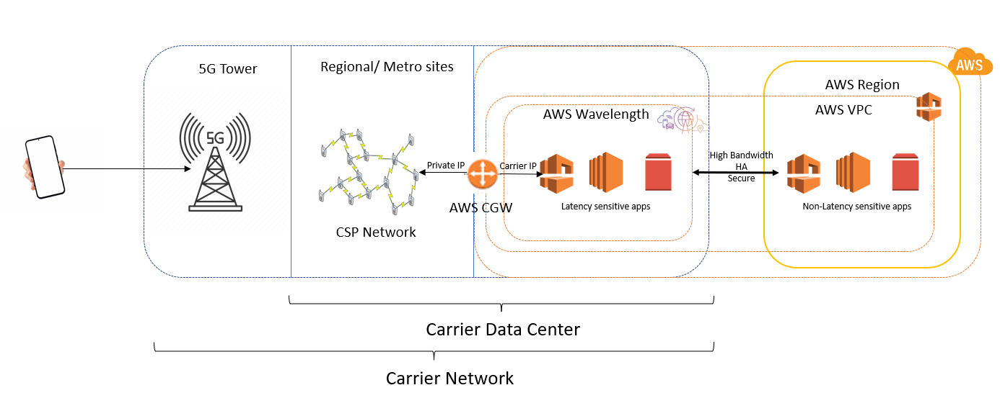

# WaveLength

- Developers can build applications that deliver ultra-low latencies to mobile devices and end users.
- It deploys standard AWS compute and storage services at the edge of 5G networks provided by telecom carriers[^1].
- Traffic stays within the communication service provider (CSP) network.
  - But we can extend our Amazon Virtual Private Cloud (VPC) to include Wavelength Zones.
- Use cases are numerous:
  - AR/VR.
  - Smart cities.
  - Realtime gaming.
  - Connected vehicles[^2].
  - ML-assisted diagnostic[^3].
  - Interactive live video streams.

## How it works

## Footnotes

[^1]: In the context of telecommunications it is a company that provides communication services. services like voice, data, and internet connectivity. Carriers operate the infrastructure necessary to deliver these services, such as mobile networks, broadband networks, and data centers. Here a carrier refers to a telecommunications company that offers 5G network infrastructure. By placing AWS services at the edge of these carriers' 5G networks, Wavelength enables applications to take advantage of lower latency and closer proximity to end-users. Examples of carriers include Verizon, AT&T, and T-Mobile in the United States, or Vodafone and Deutsche Telekom in Europe.
[^2]: Vehicles that are equipped with internet connectivity and various sensors, enabling them to communicate with other vehicles, infrastructure, and various external systems.
[^3]: ML algorithms to assist in the diagnosis of diseases and medical conditions.
